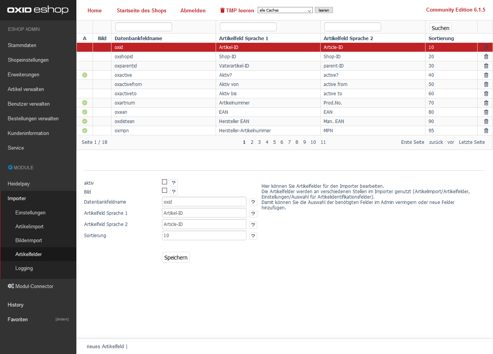

Im Admin unter [(D3) Module] / [Importer] / [Artikelfelder] können Sie einzelne Felder aus der Tabelle oxarticles definieren.  
Die Einstellungen eines jeden Felds wird beim Import und in der Adminoberfläche des Importers genutzt.  
So können individuelle Feldnamen (bspw. oxarticles__d3newfield) mit einem aussagekräftigen Namen ausgestattet werden.  

### Folgende Einstellungen kann man pro Feld definieren:
<dl>
    <dt>[Aktiv]</dt>
    <dd>De/Aktivieren Sie das Artikelfeld für die Adminoberfläche des Importers</dd>
    <dt>[Bild]</dt>
    <dd>
        <del>De/Aktivieren Sie das Artikelfeld für die Adminoberfläche des Bildimports (neue Felder werden im Admin nicht angezeigt)</del> 
        Diese Einstellung wird derzeit nicht effektiv genutzt.
    </dd>
    <dt>[Datenbankfeldname]</dt>
    <dd>Tragen Sie hier den Namen des Datenbankfelds von oxarticles oder oxartextends ein.</dd>
    <dt>[Artikelfeld Sprache 1] + [Artikelfeld Sprache 2]</dt>
    <dd>Geben Sie dem Artikelfeld einen lesbaren Namen in der entsprechenden Sprache an.</dd>
    <dt>[Sortierung]</dt>
    <dd>
        Hier können Sie die Sortierreihenfolge für den Admin festlegen.
        Oft benutzte Artikelfelder können mit einer niedrigen Zahl weiter oben angezeigt werden.
    </dd>
</dl>
  
  
### Das Modul verwendet die <u>aktiven</u> Artikelfelder in den Admin-Bereichen unter /(D3) Module/Importer/:  

<dl>
    <dt>Artikelimport/Artikelfelder</dt>
    <dd>Die Dropdown Felder unter [Spalteninhalt und Zuordnung] zeigen den [Datenbankfeldname] sowie dessen gepflegte Übersetzung [Artikelfeld Sprache n] an.</dd>
    <dt>Artikelimport/Varianten</dt>
    <dd>Die Artikelfelder beginnend mit <i>oxvarname</i> (Name der Auswahl) und <i>oxvarselect</i> (Auswahl) werden hier als einstellbare CSV-Zuordnung bereitgestellt.</dd>
    <dt>Einstellungen/Grundeinstellungen/Auswahl für Artikelidentifikationsfelder</dt>
    <dd>Der [Datenbankfeldname] wird in der Mehrfach-Auswahlliste angezeigt.</dd>
</dl>
