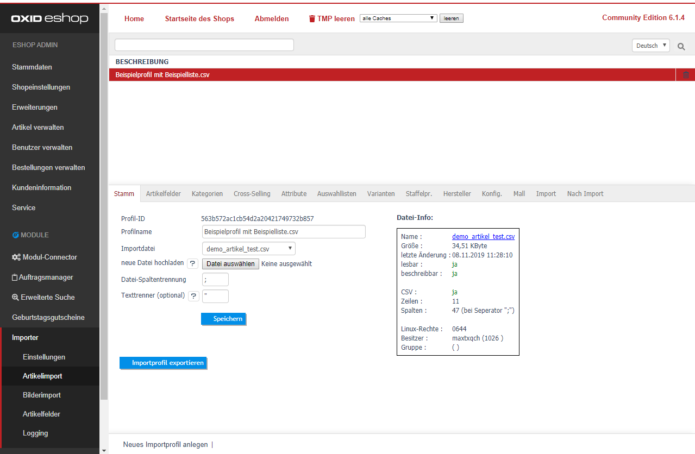

   
   
   
| Stammdaten                              | Hinweise                                                                                                                      |  
| :---------------------------------------| :-----------------------------------------------------------------------------------------------------------------------------|
| Profilname                              | Geben Sie hier Ihrer Importliste einen Namen (z.B. Hersteller XYZ Import ). |
| Importdatei                             | Zeigt die aktuelle Dateizuordnung und zeigt eine Dateiliste des Verzeichnisses `/source/import/` |
| Neue Datei hochladen                    | Klicken Sie auf [Durchsuchen] und wählen Sie eine CSV-Datei aus. (Mit [Speichern] wird die Datei auf den Server geladen.) |
| Datei-Spaltentrennung                   | Geben Sie an, welches Trennzeichen Ihre Importdatei für die einzelnen Spalten verwendet. (bspw.: ; oder \| oder TAB) | 
| Texttrenner (optional)                  | Der Texttrenner umschließt in einer CSV-Datei einzelne Zellen. (bspw.: " oder ') |

Klicken Sie dann auf [Speichern]. 
 
## Datei-Info: 
In diesem Block finden Sie alle wichtigen Informationen zu der aktuell ausgewählten Importdatei:
- Name 
- Dateigröße 
- letzte Änderung 
- Datei-Rechte (ist die Datei lesbar/beschreibbar) 
- CSV-Daten: bspw. Zeilen/Spalten Anzahl
