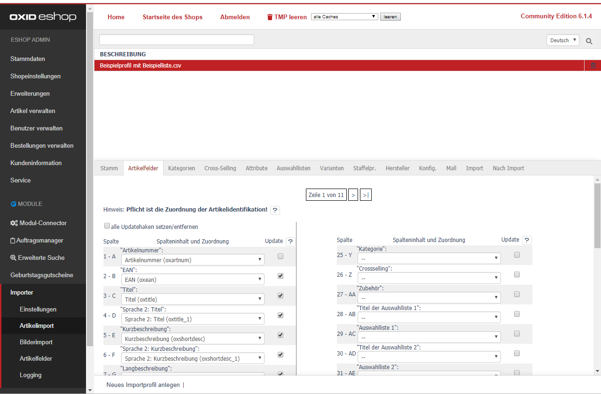

Hier können Sie die Spalten Ihrer Importdatei den jeweiligen Artikel-Datenbankfeldern zuordnen. 
 
> [!] Hinweis:  
> Lassen Sie Felder an dieser Stelle frei, für die es einen eigenen Reiter/Tab gibt.  
> bspw: Kategorie, Cross-Selling, Attribute, Auswahllisten, Varianten, Staffelpreise, Hersteller, Mall
 
Für jede CSV-Spalte wird ein Dropdown Feld angezeigt.  
Aus der aktuell ausgewählten Zeile wird der Inhalt der CSV-Zelle über dem Dropdown-Feld angezeigt.  
Sie können durch die einzelnen Zeilen in Ihrer CSV-Datei navigieren.  
Wechseln Sie von der Zeile 1 (bspw. Spaltenüberschrift) auf die Zeile 2 (nächste Artikeldaten).  

Wählen Sie aus dem Drop-Down Feld die richtige Zuordnung aus.
Hier ein paar Beispiele: 
- Titel (oxtitle) 
- Langbeschreibung (oxlongdesc)
- Suchbegriffe (oxsearchkeys)
- Preis (oxprice) 
- Bild 1-10 (oxpic1-10):
    > [!!] wichtiger Hinweis:   
    > Bitte wählen Sie statt oxpic1-10 für den Bilderimport die moduleigenen Felder:  
    > - Bild Importfeld 1 (d3importpic1) 
    > - Bild Importfeld 2 (d3importpic2) 
    > - ... 
    > - Bild Importfeld 10 (d3importpic10)

### Pflicht ist die Zuordnung der Artikelidentifikation!
> [!!] wichtiger Hinweis:  
> Das Feld für die Artikelidentifikation muss hier für jedes Importprofil zugeordnet werden.  
> Der Wert muss einzigartig sein, damit keine Artikelduplikate entstehen.  
> Bspw.: Artikelnummer, Hersteller EAN, EAN, etc.

Die Checkboxen hinter den Dropdown-Feldern regulieren, ob der Inhalt nur importiert oder geschrieben wird.  
- **Checkbox aktiv:** Ist ein Artikel bereits in der Datenbank vorhanden, wird der Inhalt aktualisiert.
- **Checkbox inaktiv:** Der Inhalt wird nur geschrieben, wenn der Artikel noch nicht existiert.

Die Einstellung zur Art des Importprofils (Import & Update, nur Import, nur Update) finden Sie im Tab [Konfig.].  
 
Klicken Sie abschließend auf [Speichern].
