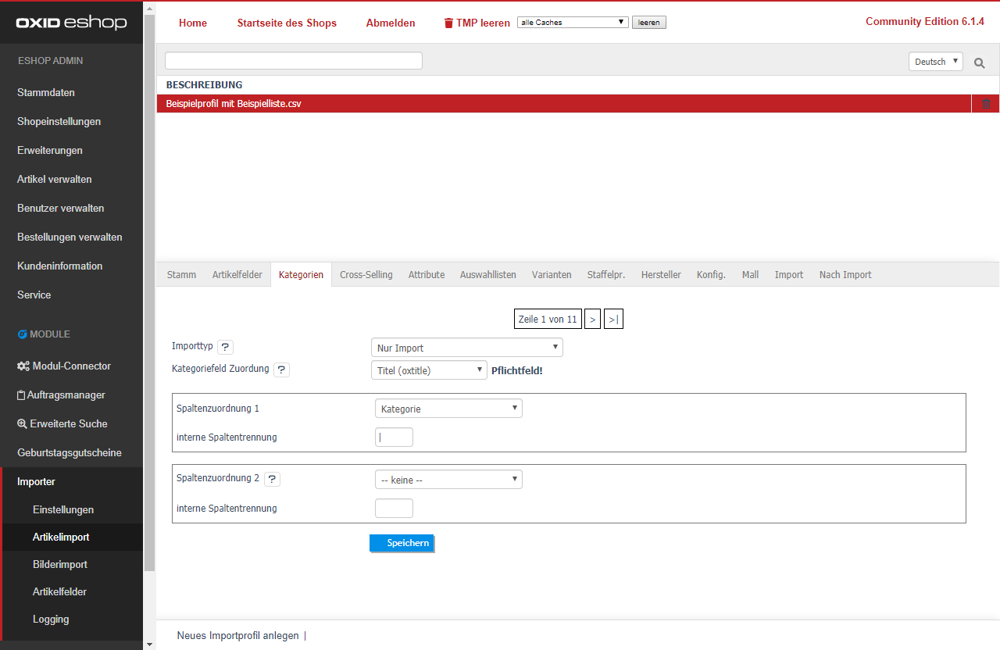

Sie können einen Artikel beliebig vielen Kategorien zuordnen.   
- Wählen Sie den [Importtyp] aus. 
    - [Nur Import] Die Kategorien werden normal importiert bzw. dem Artikel zugeordnet 
    - [Artikel-Kat.-Zuordnungen vorher löschen] Alle Kategorie-Zuordnungen des aktuellen Artikels werden vor dem Import gelöscht. 
- [Kategoriefeld Zuordnung] Wählen Sie die gewünschte Identifikation der Zuordnung aus.  

| Folgende Werte stehen standardmäßig zur Auswahl: |  |
|:-----------------------------|:------------------------------------------------|
| oxtitle                      | exakter Name der Kategorie / Kategoriebaum  |
| oxid                         | shopinterne Identifikation der Kategoie |
| oxsort                       | Sortierungsnummer der Kategorie |
| oxdesc                       | Kurzbeschreibung der Kategorie |

- [Spaltenzuordnung n] Wählen Sie in dem Dropdown-Feld die CSV-Spalte aus, welche den Inhalt der [Kategoriefeld Zuordnung] hat. 
- [interne Spaltentrennung] Wenn Sie beispielsweise [Hauptkategorie|Unterkategorie|Unterunterkategorie] angegeben haben, tragen Sie das Zeichen | ein. 
 
Beim Import wird registriert, ob die Kategorie Struktur in dieser Form besteht. Wenn nicht, wird diese mit der Information der [Spaltenzuordnung n] angelegt.  
> [!]Bitte achten Sie auf die korrekte Schreibweise, Groß- und Kleinschreibung! 
 
Sie können einen Artikel beliebig vielen Kategorien zuordnen.  
Neue Möglichkeiten der [Spaltenzuordnung n] werden nach dem Speichern automatisch erweitert.  
 
Klicken Sie abschließend auf [Speichern]. 

> [i] Weitere Informationen finden Sie unter [Häufig gestellte Fragen](../../080_Haeufig_gestellte_Fragen.md)
