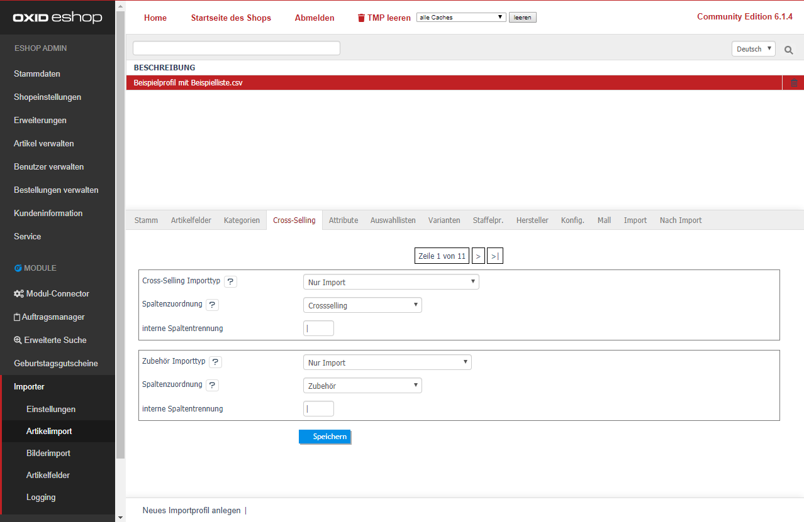

## Cross-Selling
- Wählen Sie den [Cross-Selling Importtyp] aus. 
    - [Nur Import] Das Cross-Selling wird normal dem Artikel zugeordnet
    - [[Artikel-Cross-Sell.-Zuordnungen vorher löschen] Alle Zuordnungen des aktuellen Artikels werden vor dem Import gelöscht. 
- [Spaltenzuordnung n] Wählen Sie in dem Dropdown-Feld die entsprechende CSV-Spalte aus. 
- [interne Spaltentrennung] Wenn Sie beispielsweise [7353|80085|0815] angegeben haben, tragen Sie das Zeichen | ein. 

## Zubehör
- Wählen Sie den [Zubehör Importtyp] aus. 
    - [Nur Import] Das Zubehör wird normal dem Artikel zugeordnet
    - [[Artikel-Zubehör-Zuordnungen vorher löschen] Alle Zuordnungen des aktuellen Artikels werden vor dem Import gelöscht. 
- [Spaltenzuordnung n] Wählen Sie in dem Dropdown-Feld die entsprechende CSV-Spalte aus. 
- [interne Spaltentrennung] Wenn Sie beispielsweise [1402|1503|0815] angegeben haben, tragen Sie das Zeichen | ein. 

Klicken Sie abschließend auf [Speichern].
