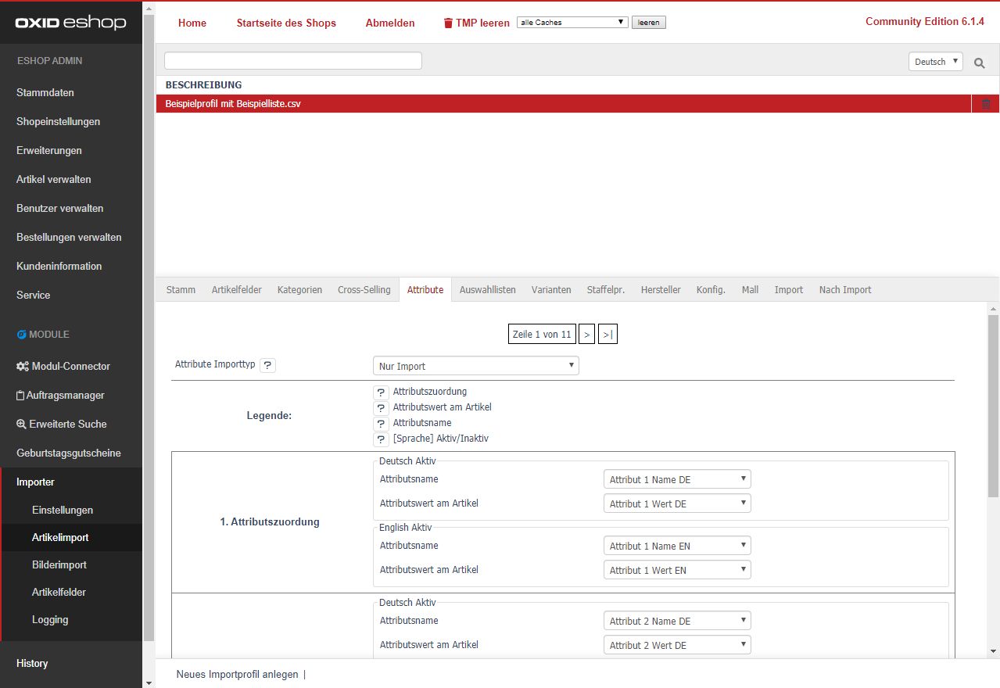

- Wählen Sie den [Attribute Importtyp] aus: 
  - [Nur Import] Die Attribute werden normal dem Artikel zugeordnet.
  - [Artikel-Attribut-Zuordnungen vorher löschen] Alle Attribut-Zuordnungen des aktuellen Artikels werden vor einem Update gelöscht. 
 
> [i] In Version 4.4.1.0 gab es eine Umstellung der Attributszuordnungen. Weitere Informationen finden Sie in unserer FAQ: [Anleitung zur Umstellung von Attributszuordnungen](https://faq.d3data.de/module/importer/anleitung-zur-umstellung-von-attributszuordnungen/). 

- [n. Attributszuordnung] Sie können mehrere Attribute importieren.  
   Jede Attributszuordnung wird als Attribut angesehen. D.h. für 1 Attribut kann nur eine Attributszuordnung verwendet werden.  
  - pro Sprache können Sie Name und Wert definieren: 
    - [Attributsname] Wählen Sie die CSV-Spalte mit dem Namen des Attributs aus.   
      Bspw. "_Material_",  "_Höhe_" oder "_Farbe_" (ohne Anführungszeichen). 
    - [Attributswert am Artikel] Wählen Sie hier die zugehörige CSV-Spalte mit dem Wert des Attributs am Artikel aus.   
      Bspw. "_Aluminium_",  "_30cm_" oder "_matt_" (ohne Anführungszeichen). 

Neue Möglichkeiten der [n. Attributszuordnung] werden nach dem Speichern automatisch erweitert.
 
Klicken Sie auf [Speichern] um die Attributszuordnung zu sichern. 

