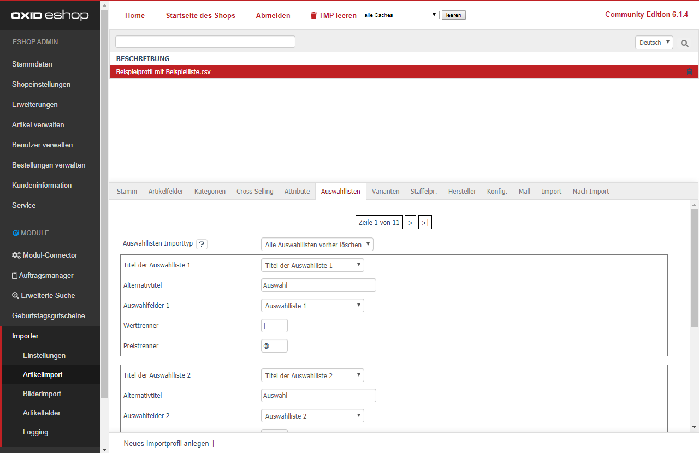

- [Auswahllisten-Importtyp] 
  - [Nur Import] Eine neue Auswahlliste wird erstellt und dem Artikel zugeordnet. 
  - [Alle Auswahllisten vorher löschen] Alle Auswahllisten, die ausschließlich dem aktuellen Artikel zugeordnet sind, werden vor dem Update gelöscht.  
- [Titel der Auswahlliste n] Geben Sie hier die CSV-Spalte an, worin der Titel z.B. _"Farbe"_ hinterlegt ist.
- [Alternativtitel] Ist kein "Titel der Auswahlliste" vorhanden oder ist der Inhalt teilweise leer, so kann hier ein Alternativtitel z.B. _"Auswahl"_ angegeben werden.
- [Auswahlfelder n] Wählen Sie die CSV-Spalte aus, welche die Auswahlen (Werttrenner-separiert) z.B. _"rot\|grün\|blau"_ enthält.
- [Werttrenner] Stehen mehrere Werte im CSV-Importfeld "Auswahlfelder", so muss der verwendete Werttrenner angegeben werden. Z.B. "@" wenn in der CSV "rot@gelb@grün" steht.
- [Preistrenner] Zusätzlich können Preisänderungen (absolute Werte und in %) importiert werden. z.B. "rot\|2,34@gelb\|5%@grün\|1,23". In dem Beispiel müsste als Werttrenner "@" und als Preistrenner "\|" eingetragen werden.

Es sind beliebig viele Auswahllisten mit entsprechenden Werten pro Artikel importierbar. 

> [i] Hinweise:  
> Auswahllisten werden immer neu angelegt.   
> Eine Zuordnung wird nicht unterstützt, da eine Auswahlliste nicht eindeutig sein muss.  
> Fallbeispiel: Zwei Artikel haben jeweils eine Auswahlliste mit Namen **Farbe**:  
> - T-Shirt A: 
>   - Name der Auswahlliste: **Farbe** 
>   - Werte: **rot, blau**  
> - T-Shirt B: 
>   - Auswahlliste: **Farbe** 
>   - Werte: **gelb, grün**  
>
> Die Auswahlliste hat keine eindeutige Identifizierungsmöglichkeit.

Klicken Sie abschließend auf [Speichern]. 
