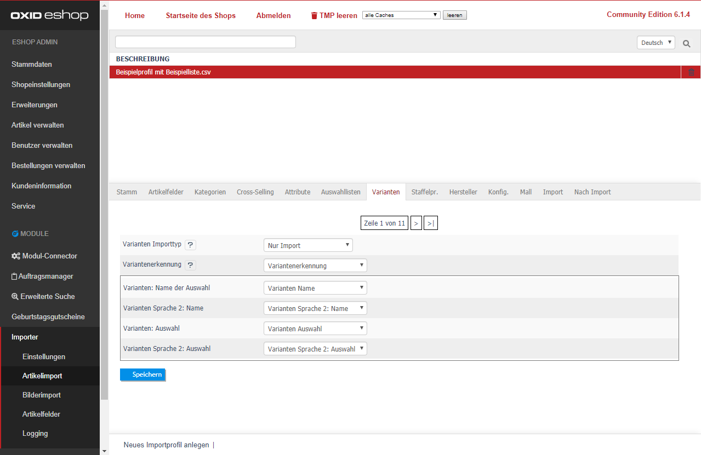

- [Varianten Importtyp] 
  - [Nur Import] Die Varianten werden dem Eltern-Artikel neu zugeordnet oder aktualisiert 
  - [Varianten vorher löschen] Alle Varianten-Artikel des aktuellen Eltern-Artikels werden vor dem Update gelöscht.  
- [Variantenerkennung] Geben Sie hier die CSV-Spalte mit der Artikelidentifikation (z.B. Artikelnummer, EAN, etc.) an.  
  Der Eltern-Artikel wird daran identifiziert und dient der Zuordnung der Variante.
- [Name der Auswahl] Diese sollte nur am Eltern-Artikel hinterlegt werden und definiert, wie die Auswahl zwischen den verschiedenen Varianten heißen soll. Z.B.: _"Größe"_, _"Farbe"_, _"Material"_
- [Sprache 2: Name] Wählen Sie optional die CSV-Spalte für die 2te Sprache (Sprach-ID 1, [Name der Auswahl] hat die Sprach-ID 0)  aus. Z.B.: _"size"_, _"color"_, _"material"_
- [Varianten: Auswahl] Hier wählen Sie die CSV-Spalte mit den Inhalten für die Variante aus. Z.B.: _"rot"_, _"grün"_, _"blau"_
- [Varianten Sprache 2: Auswahl] Wählen Sie optional die CSV-Spalte für die 2te Sprache (Sprach-ID 1, [Varianten: Auswahl] hat die Sprach-ID 0)  aus. Z.B.: _"red"_, _"green"_, _"blue"_

Klicken Sie abschließend auf [Speichern].
