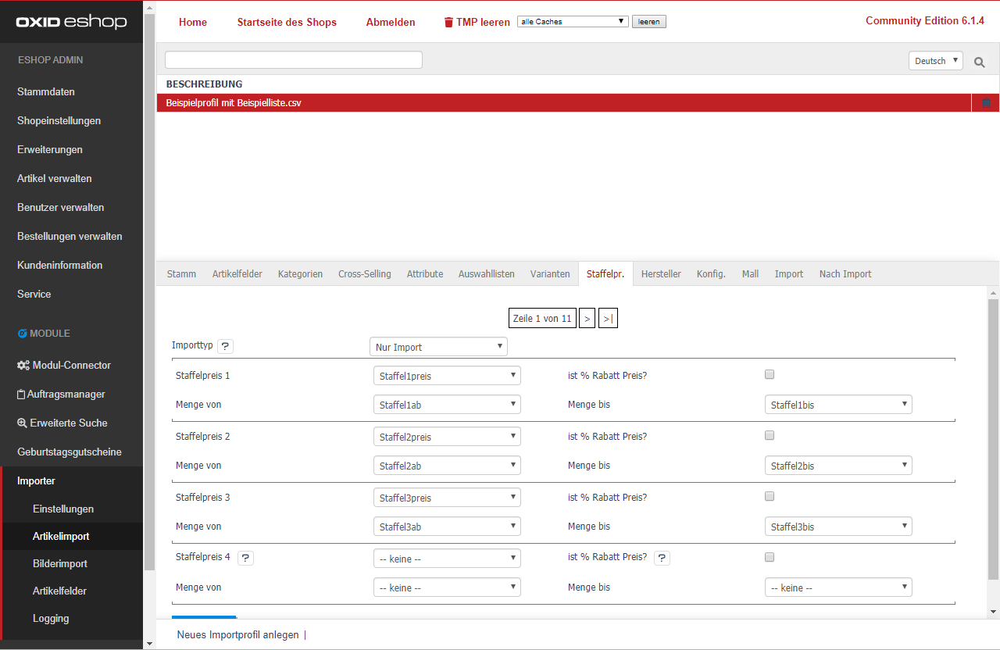

- [Importtyp] 
  - [Nur Import] Die Staffelpreise werden dem Artikel neu zugeordnet oder aktualisiert. 
  - [Staffelpreise vorher löschen] Alle Staffelpreise des Artikels werden vor dem Update gelöscht. 

- Jede Preisstaffel benötigt mind. 3 Datenfelder: 
  - [Staffelpreis n] CSV-Spalte mit dem jeweiligen Staffelpreis wählen 
  - [Menge von] CSV-Spalte mit dem "ab Preis" wählen 
  - [Menge bis] CSV-Spalte mit dem "bis Preis" wählen 
  - [ist % Rabatt Preis?] Hier definieren Sie (optional), ob die Preisstaffel als prozentual importiert wird.  
  Alternativ können Sie in der CSV-Datei den Wert in der Spalte [Staffelpreis n] mit % versehen (bspw.  5% oder 10%). 
 
Klicken Sie abschließend auf [Speichern].

> [i] Weitere Informationen finden Sie unter [Häufig gestellte Fragen](../../080_Haeufig_gestellte_Fragen.md)
