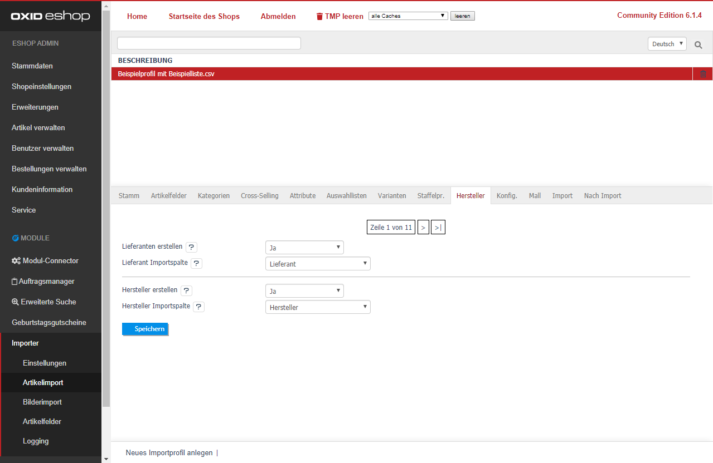

- [Lieferanten Importspalte] / [Hersteller Importspalte]  Ordnet die Dateispalte mit dem Lieferanten- bzw. Herstellernamen zu.  
  - [ Ja] Existiert der Lieferant/Hersteller nicht im Shop, wird er neu angelegt und dem Artikel zugeordnet.   
  - [Nein, nur Zuordnung] Der Artikel wird nur einem vorhandenen Lieferant/Hersteller zugeordnet.   
  
Klicken Sie abschließend auf [Speichern]. 
