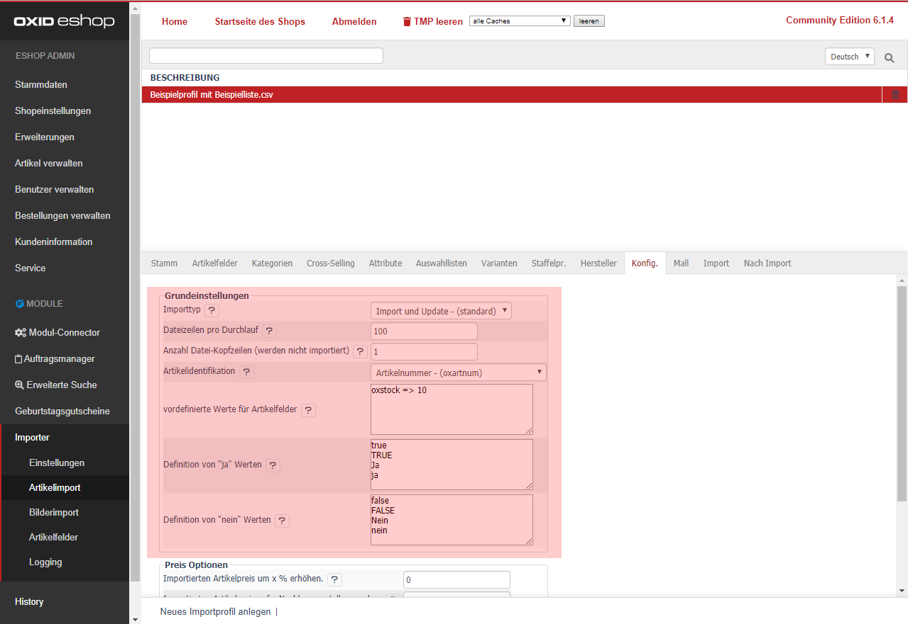

- [Importtyp] 
  - [Import und Update] Alle CSV-Daten werden erst aktualisiert und anschließend -wenn nicht vorhanden- importiert. 
  - [Nur Import] Alle CSV-Daten werden nur importiert. Vorhandene Artikeldaten werden **nicht** überschrieben. 
  - [Nur Update] Alle CSV-Daten werden nur geschrieben, wenn bereits ein Artikel in der Datenbank gefunden wurde. 
- [Dateizeilen pro Durchlauf]  
  Legen Sie fest, wie viele Zeilen pro Importdurchlauf geladen werden sollen.  
  Wenn Sie z.B. 100 eintragen, werden die ersten 100 Zeilen importiert.  
  Danach wird die untere Seite neu geladen und die nächsten 100 Zeilen werden importiert, solange bis die komplette CSV-Datei eingelesen ist.  
  Damit wird sichergestellt, dass der Importvorgang nicht abbricht (durch bspw. eingestellte Server Limitierungen).  
- [Anzahl Datei-Kopfzeilen (werden nicht importiert)]  
  Wenn Sie eine Spaltenüberschrift in Ihrer Import-Datei haben, können Sie die Anzahl der zu überspringenden Zeilen eintragen.  
- [Artikelidentifikation]   
  Legen Sie die eindeutige Artikelidentifikation fest. Das gewählte Feld **muss zwingend** unter [Artikelfelder], einer Importspalte zugeordnet werden.
- [Definition von "ja" und "nein" Werten]  
  In einer CSV-Datei können verschiedene Werte für einen "Aktiv"-Haken stehen.  
  bspw.: _Ja/Nein_, _true/false_, _1/0_, _j/n_, _aktiv/inaktiv_.  
  Geben Sie die einzelnen Werte zeilenweise getrennt ein, damit beim Importvorgang die Werte für den Shop übersetzt werden können.  

> [i] Weitere Informationen finden Sie unter [Häufig gestellte Fragen](../../../080_Haeufig_gestellte_Fragen.md)
