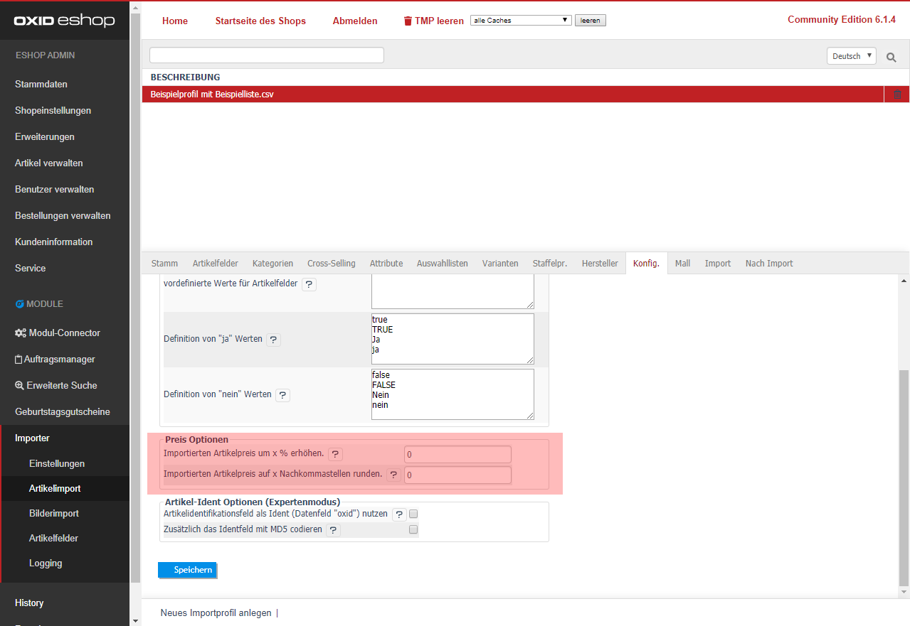

---
title: Preis Optionen
---  

- [ Importierten Artikelpreis um x % erhöhen. ]  
  Hier können Sie den importierten Artikelpreis prozentual erhöhen.  
- [ Importierten Artikelpreis auf x Nachkommastellen runden. ]  
  Geben Sie hier einen Wert ein, um den Artikelpreis zu runden.  
  Beispiel: "2" bedeutet, dass von 12.3456 auf 12.35 oder von 1.95583 auf 1.96 gerundet wird.  
  bei "1" wird von 12.3456 auf 12.3 oder von 1.95583 auf 2 gerundet.  

> [!]Hinweis:  
> Beide Optionen greifen lediglich bei dem normalen Artikelpreis (oxprice)!
