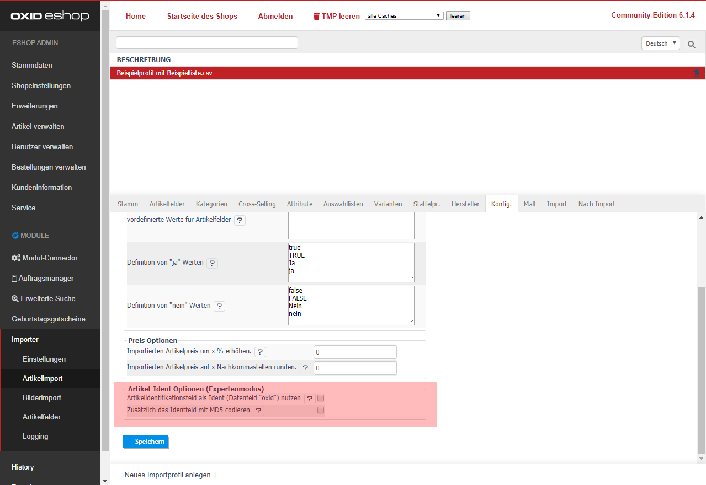

---
title: Artikel-Ident Optionen (Expertenmodus)
---  

- [ Artikelidentifikationsfeld als Ident (Datenfeld "oxid") nutzen ]  
  Mit dieser Einstellung wird die verwendete [Artikelidentifikation] als interne Shop-Identifikationsnummer (oxid) genutzt.
  Der Shop verwaltet die eindeutigen Shop-Identifikationsnummern selbst, daher sollte die Option mit Bedacht genutzt werden. 

- [ Zusätzlich das Identfeld mit MD5 codieren ]  
  Damit kann ein ähnlicher Ident wie bei einer oxid erzeugt werden.
  Diese Option greift nur mit der aktiven Option [Artikelidentifikationsfeld als Ident (Datenfeld "oxid") nutzen].

Klicken Sie abschließend auf [Speichern].
