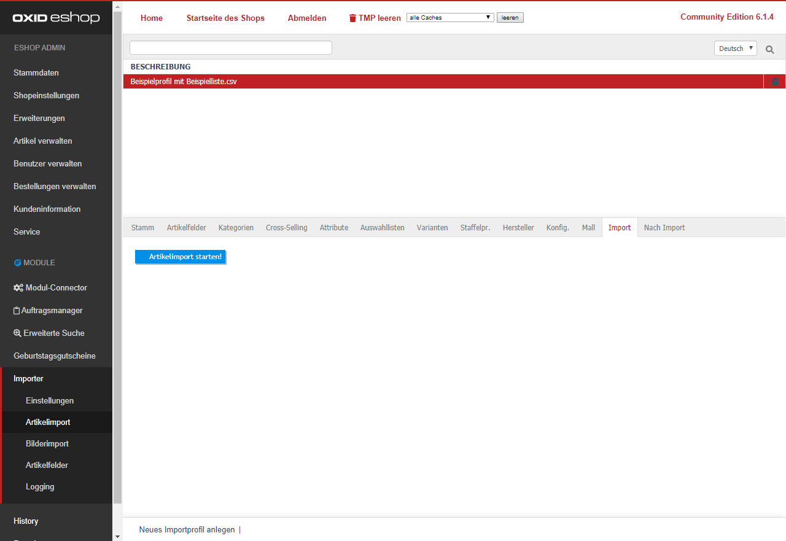
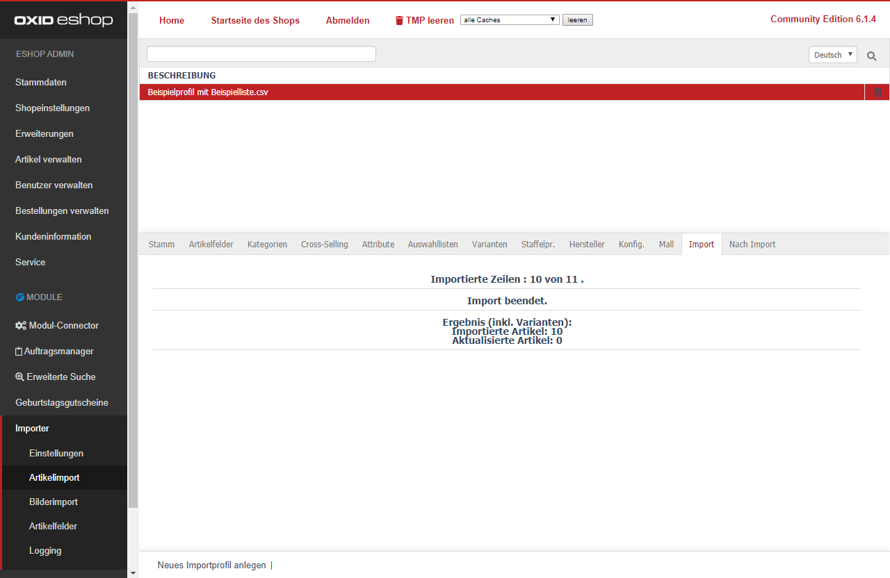

Wenn Sie nun alle Einstellungen gespeichert haben, können Sie den [Artikelimport starten].  
Danach zeigt Ihnen der Import, wie viele Zeilen aus Ihrer CSV-Datei importiert wurden, sowie das Ergebnis der bearbeiteten Artikel.  

