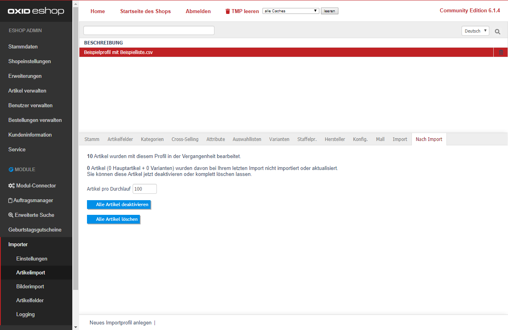

Sie sehen eine Übersicht, wie viele Artikel bereits mit diesem Profil bearbeitet wurden.
(Die Informationen orientieren sich an Einträgen aus der Spalte d3importprofileid in oxarticles.)
Folgende Einstellungen können Sie vornehmen:
- [ Artikel pro Durchlauf ]  
  Legen Sie fest, wie viele Zeilen pro Durchlauf geladen werden sollen.  
  Wenn Sie z.B. 100 eintragen, werden die ersten 100 Artikel bearbeitet.  
  Danach wird die untere Seite neu geladen und die nächsten 100 Artikel werden bearbeitet.  
- [Alle Artikel deaktivieren] - deaktiviert alle Artikel 1.
- [Alle Artikel löschen] - löscht alle Artikel 1.  
  
1. Betrifft Artikel, welche mit dem letztem Import **dieses** Profils nicht aktualisiert wurden.  
Wurde ein Artikel bereits mit einem anderen Profil bearbeitet, wird dieser nicht beeinflusst.

