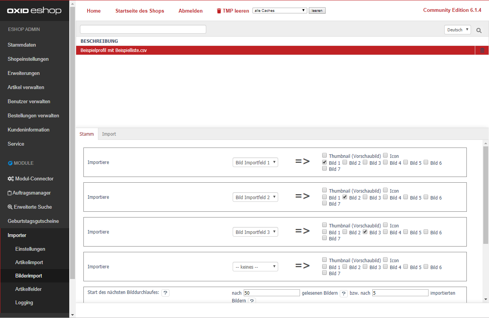

- [Importiere] Wählen Sie ein [Bild Importfeld n] in dem Dropdown Feld aus.  
  Dieses wurde von Ihnen unter [Artikelimport] / [[Artikelfelder]](../040_Artikelimport/040_Artikelfelder.md) zugeordnet.  
  Danach wählen Sie für das [Bild Importfeld n] das zugehörige Ziel aus (Thumbnail, Icon, Bild 1-10).  
  Nach jedem Speichern öffnet sich ein neues Feld für die Zuordnung.
- [ Start des nächsten Bilddurchlaufes ]  
  Mit den Einstellungen nach 50 [gelesenen Bildern] bzw. nach 10 [importierten Bildern] können Sie den Start des folgenden Import-Durchlaufs regulieren.  
  (Bei leistungsstarken Servern können die Einstellungen ggf. höher gesetzt werden.)
- [lokale Bilder (/import/pictures/) durch Externe überschreiben? ]  
  **Aktiv:** Sofern ein externes Bild den gleichen Namen hat, wird das lokale Bild überschrieben.  
  **Inaktiv:** Sofern ein externes Bild den gleichen Namen und eine unterschiedliche Größe zu dem lokalen Bild hat, wird der Name des externen Bilds mit einem Zusatz (DateinameZusatz.Endung) versehen. 
- [Masterbilder am Artikel vorher entfernen (empfohlen)]  
  Aktivieren Sie diese Option, um Bilder-Altlasten auf dem Server zu vermeiden.  
  Während des Importvorgangs werden vorherige Artikelbilder über die Shop Logik entfernt.  
  Die Löschung umfasst die Bilder des aktuellen Artikels im "/master/" und die generierten Bilder im "/generated/" Verzeichnis.  
   
  Deaktivieren Sie diese Option, so werden die Bilder direkt importiert.  
  Es können dabei in den `/source/out/master/product/*/` Verzeichnissen ungenutzte Bilddateien entstehen.   
- [Aktion nachdem ein Bild importiert wurde]  
  Wählen Sie eine entsprechende Option aus, damit die Bilder im `/source/import/pictures/` Verzeichnis gelöscht oder in ein anzugebendes Verzeichnis verschoben werden.  
  Das Verzeichnis ist mit absolutem Pfad anzugeben, bspw: `/var/www/myshop.de/{VerzeichnisName}/` 

Klicken Sie abschließend auf [Speichern].
