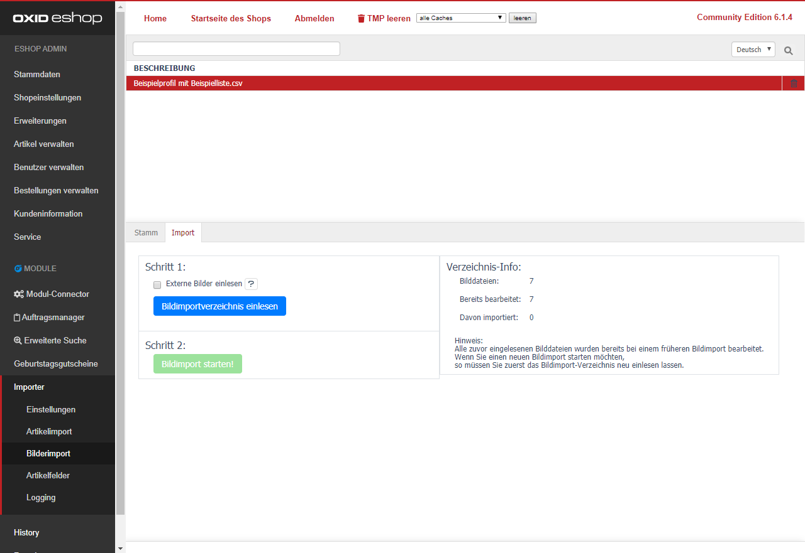
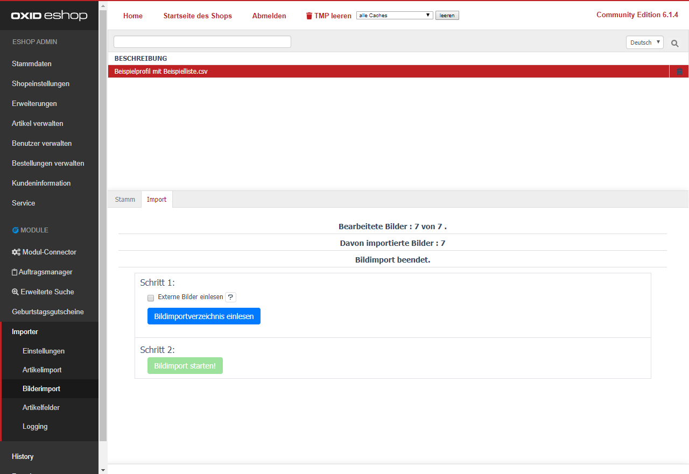

Wenn Sie externe Bilder importieren möchten, aktivieren Sie die Option [Externe Bilder einlesen].  
Klicken Sie danach auf [Bildimportverzeichnis einlesen].  
Damit werden die Artikelbilder (von extern heruntergeladen, wenn aktiv und) für den Import registriert.  

Wenn alle Bilddateien korrekt in der Verzeichnis-Info gezeigt werden, können Sie den [Bildimport starten].  
Der Vorgang liest die Metadaten des Bildes und übergibt Sie geordnet dem Shop-Framework.  
Der Shop versetzt das Bild in das korrekte Verzeichnis. 
 
 
